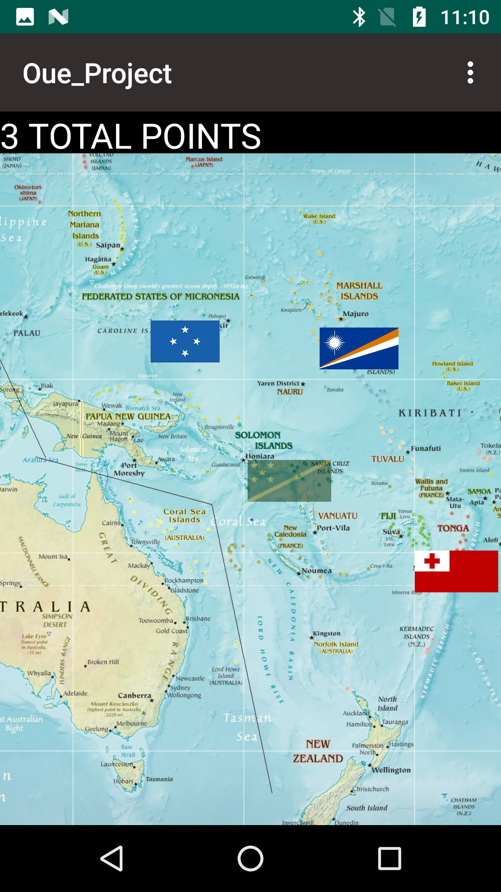
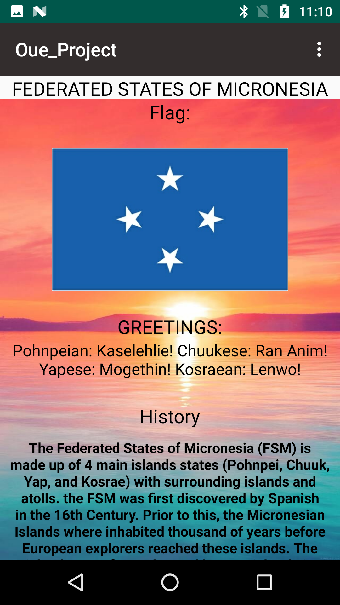
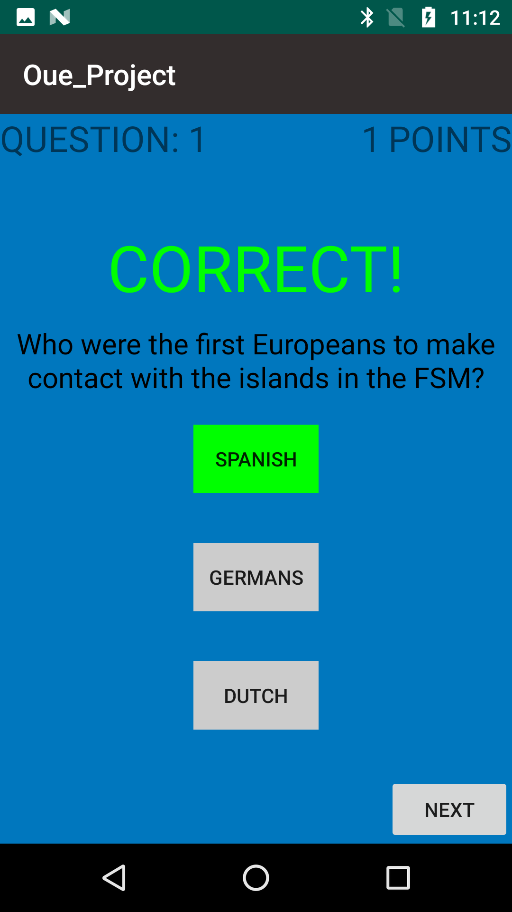

# KnowOceania
## An Android App developed using Android Studio that features an Island Trivia gamed aimed to educate users about the vast Islands in the Pacific  

### Application features a Pacific Map layout with hovering flags which when clicked, features a content from that particular country. In order to progress, users must take a small trivia quiz to gain points and unlock new flags.

   
